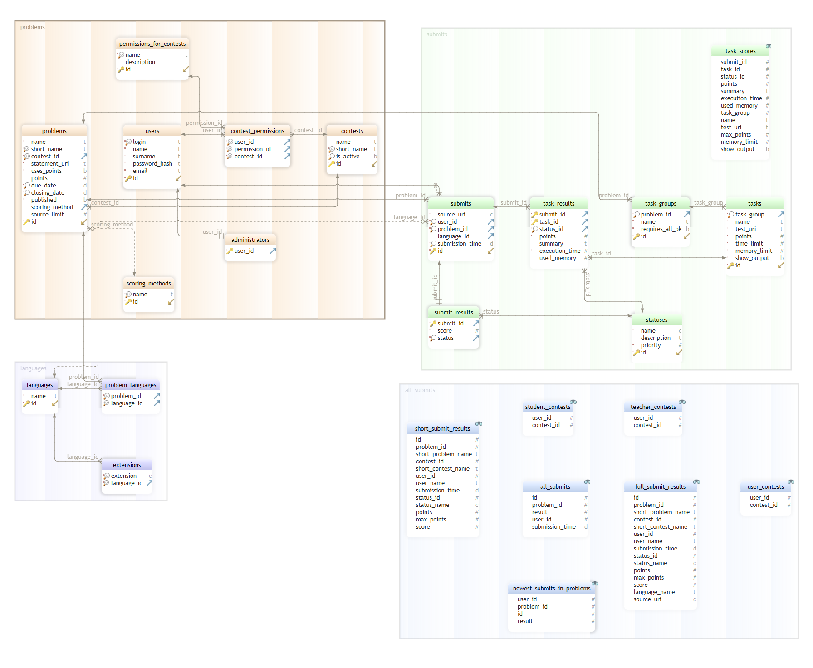

# Tanuki - Simple programming contests system

Project made as an assignment project for Data Engineering course 2021/22


# Installation

### Prerequisites

- Docker
- make
- docker-compose

### Installation

```
git clone https://github.com/mhorod/tanuki.git
cd tanuki
/bin/bash run-release.sh
```

You can then access the app on http://localhost:3000

# Usage

## Accessing the database

First `docker ps` to lista active containers

Then run `docker exec -it {container} bash` where `{container}` is id of
postgres container

Finally inside container run `psql -U tanuki` to log into the database

## Navigation

Most of the times navigation on the page should be intuitive.

Main things that may be useful:

- There is `admin` account which also has passowrd `admin123`. After logging
  into it you will be able to list contests and users

- Every user in the database has password `admin123` so you can explore website
  as a randomly generated user

- By default new users are not assigned to any contests.
- To add your new user to a contest follow:
  1. Log into `admin`
  2. click `edit contests` and choose contests of your interest
  3. add `admin` as owner and press `edit`
  4. go to the main page by clicking the logo in top left corner
  5. From managed contests select added contest Now you should see a blue
     teacher panel
  6. Click on `Users`, then `add user`
  7. Select deisred user from the list
  8. you can now log out and log in as your user

- Student's page is grey, teacher's and admin's are blue
- Clicking on logo will redirect you back to the main page

# Development

### Prerequisites

- Docker
- docker-compose
- make

## Starting the app

To start app in development mode run `bash run-dev.sh`. It builds the image with
`make` and `docker-compose` and then starts the app.

App runs on port `3000` and postgres runs on port `5433`

We are aware of permission problem related to the fact that docker connects
container files with local ones which makes programs running inside containers
have no access to the files.

# Database layout

